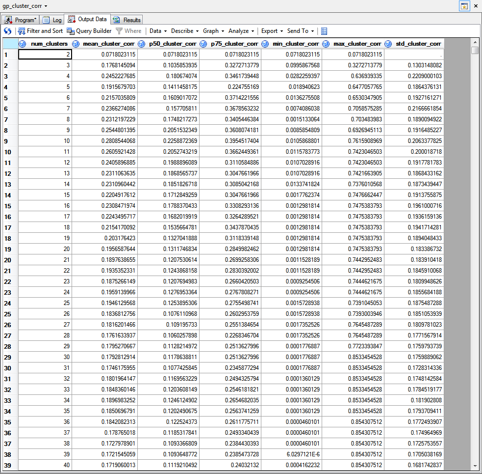
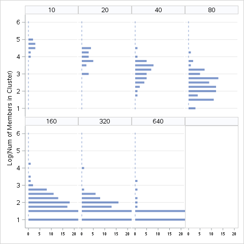
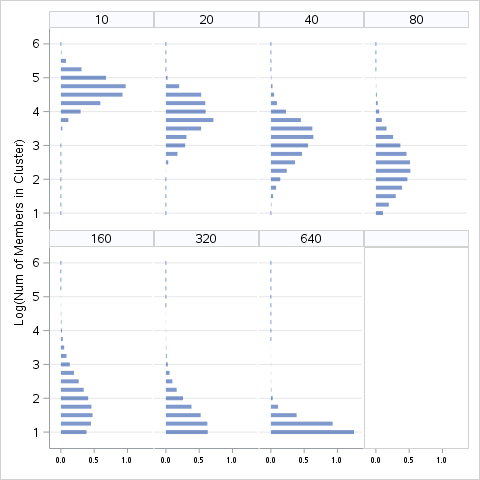

# sas-macro-lib
This library contains some useful macros for performing information value related tasks in SAS, 
including
* Calculating information value
* Calculating and plotting Population Stability Index (PSI) over time
* Slicing dataset vertically (N by M to N by M<sub>1</sub>, N by M<sub>2</sub>, etc. where M = 
M<sub>1</sub> + M<sub>2</sub> ...)
* Calculating concordance on a univariate basis
* Calculating cluster correlation distribution by progress of cluster decomposition based on VarClus
* Calculating cluster size distribution by progress of cluster decomposition based on VarClus

Moreover, I would hope this codebase can serve as a starting point for normalizing coding style 
in SAS.

# Usage
macro library for: General purpose           
macro prefix     : gp_                       
macro list       : gp_info_value             
                   gp_stability_chart        
                   gp_stability_index        
                   gp_var_split              
                   gp_univariate_c           
                   gp_cluster_corr           
                   gp_cluster_size           
                                             
use %gp_help(macro_name) for more info. 

# Examples
## gp_cluster_corr
```sas
%gp_cluster_corr(
    data_table  = train.diag_3,
    out_table   = check,
    agg_funcs   = mean p50 p75 min max std,
    delete_flag = 1
)
```

### screenshot of the result table


## gp_cluster_size
```sas
%gp_cluster_size(
    data_table = train.diag_3,
    delete_flag = 1,
    plot_flag = 1,
    log_flag = 1,
    plot_clus_list = 10 20 40 80 160 320 640,
    plot_num_cols = 4,
    plot_width = 5in,
    plot_height = 5in
)
```
### screenshot of histogram plot


### screenshot of histogram plot


